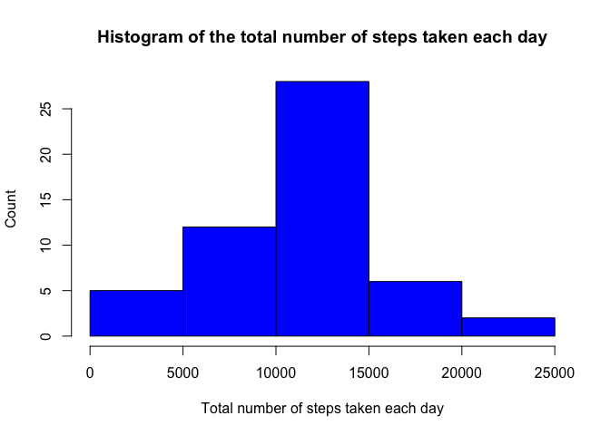
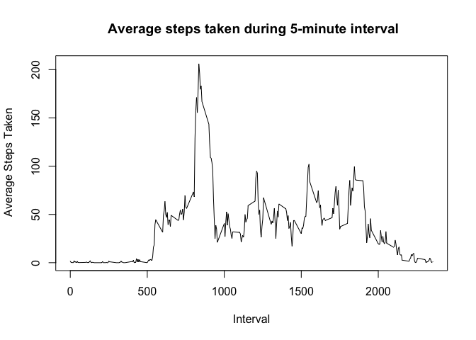
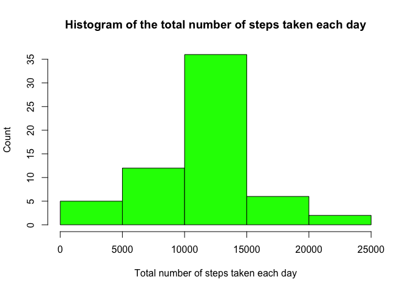
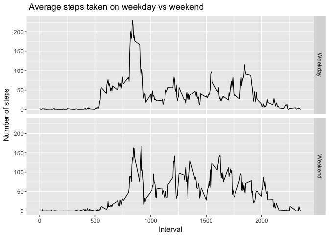

# Reproducible Research: Peer Assessment 1


## Loading and preprocessing the data

First, loading the required librarys.

```r
library(lubridate)
library(dplyr)
```

Reading the data and making the needed transformations

```r
activity <- read.csv("activity.csv")

#taking out missing values in 'steps' variable
data <- activity[with(activity, {!is.na(steps)}),]

#changing the date entries from factor to date class
data$date <- ymd(data$date)
```


## What is mean total number of steps taken per day?

1. Make a histogram of the total number of steps taken each day

```r
# First group the table by days
ByDays <- group_by(data, date)
#adding a new variable 'totalSteps' to show the total number of steps taken per day
data_by_days <- summarize(ByDays, totalSteps = sum(steps))

#plotting the histogram
hist(data_by_days$totalSteps, main = "Histogram of the total number of steps taken each day", xlab = "Total number of steps taken each day", ylab = "Count", col = "blue")
```

<!-- -->

2. Calculate and report the mean and median of total number of steps taken per day

```r
meanOFsteps <- mean(data_by_days$totalSteps)
medianOFsteps <- median(data_by_days$totalSteps)
```

The mean of total steps taken per day is 1.0766189\times 10^{4} while the median of total steps taken per day is 10765.

## What is the average daily activity pattern?

1. Make a time series plot (i.e. type = "l") of the 5-minute interval (x-axis) and the average number of steps taken, averaged across all days (y-axis)


```r
#First, grouping by the interval and average the steps
data_by_intervals <- data %>% group_by(interval) %>% summarize(averageSteps = mean(steps)) 

#plotting the time series
with(data_by_intervals, plot(interval, averageSteps, type = "l", ylab = " Average Steps Taken", xlab = "Interval", main = " Average steps taken during 5-minute interval"))
```

<!-- -->

2. Which 5-minute interval, on average across all the days in the dataset, contains the maximum number of steps?


```r
maxInterval <- data_by_intervals$interval[which.max(data_by_intervals$averageSteps)]
```
The maximum number of steps happened during interval 835.

## Imputing missing values

1. Calculate and report the total number of missing values in the dataset (i.e. the total number of rows with NAs)


```r
totalmissing <- sum(is.na(activity$steps))
```
The total number of missing values in the dataset is 2304.

2. Devise a strategy for filling in all of the missing values in the dataset. The strategy does not need to be sophisticated. For example, you could use the mean/median for that day, or the mean for that 5-minute interval, etc.
3. Create a new dataset that is equal to the original dataset but with the missing data filled in.


I decided to use the 'number of average steps' for each interval to replace the NA value for that interval. The new dataset with the missing data filled in is called 'imputedata'


```r
imputedata <- activity
for (i in 1: nrow(imputedata)){
    if (is.na(imputedata$steps[i])){
        inter <- imputedata$interval[i]
        val <- data_by_intervals$averageSteps[data_by_intervals$interval== inter]
        imputedata$steps[i] <- val
        }
}
```

4. Make a histogram of the total number of steps taken each day and Calculate and report the mean and median total number of steps taken per day. Do these values differ from the estimates from the first part of the assignment? What is the impact of imputing missing data on the estimates of the total daily number of steps?


```r
newdataBydays <- imputedata %>% group_by(date) %>% summarize(totalSteps = sum(steps))
hist(newdataBydays$totalSteps, main = "Histogram of the total number of steps taken each day", xlab = "Total number of steps taken each day", ylab = "Count", col = "green")
```

<!-- -->

Now to calculate mean and median of total number of steps taken per day

```r
meanSteps <- mean(newdataBydays$totalSteps)
medianSteps <- median(newdataBydays$totalSteps)
```

The mean of total steps taken per day is 1.0766189\times 10^{4} while the median of total steps taken per day is 1.0766189\times 10^{4}.
The mean has not changed but the median has increased a bit and now is equal to the mean. filling the missing values with the average number of steps has impacted the median but not the mean.

## Are there differences in activity patterns between weekdays and weekends?

1. Create a new factor variable in the dataset with two levels -- "weekday" and "weekend" indicating whether a given date is a weekday or weekend day.


```r
day <- wday(imputedata$date)
imputedata$Days [day %in% c(1,7)] <- "Weekend"
imputedata$Days [!(day %in% c(1,7))] <- "Weekday"
```

2. Make a panel plot containing a time series plot (i.e. type = "l") of the 5-minute interval (x-axis) and the average number of steps taken, averaged across all weekday days or weekend days (y-axis). The plot should look something like the following, which was created using simulated data:


```r
dataIntervals <- imputedata %>% group_by(interval, Days) %>% summarize(averageSteps = mean(steps)) 
 
#plotting the time series
library(ggplot2)
qplot(interval, averageSteps,data= dataIntervals, geom = "line", ylab = " Number of steps", xlab = "Interval", main = " Average steps taken on weekday vs weekend", facets = Days ~.) 
```

<!-- -->

These plots show that activities start earlier on weekdays which is what we would expect normally.
